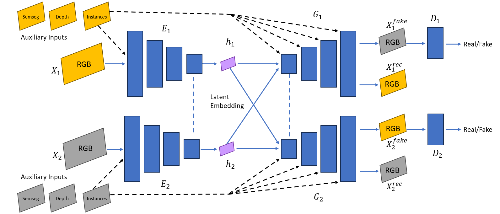

# Bridging Driving Conditions 🚘

This repository contains the demo website for the paper:

**"Bridging Clear and Adverse Driving Conditions: Domain Adaptation with Simulation, Diffusion, and GANs"**

🌐 [View the interactive site](https://yahiashowgan.github.io/bridging-driving-conditions/)  
📄 [Paper](https://arxiv.org/abs/2508.13592)

---

*Our proposed SDG-DA pipeline: clear images → simulation → diffusion → blending → DA-UNIT → realistic adverse images.*

---

## About

Autonomous Driving (AD) systems struggle in adverse conditions like fog, rain, and nighttime due to under-represented training data.  
This work proposes a **target-data-free domain adaptation pipeline** that transforms clear-weather driving images into realistic foggy, rainy, snowy, and nighttime scenes.  

We combine **simulation (CARLA)**, **diffusion models (Stable Diffusion / ALDM)**, and **GANs (DA-UNIT)** with adaptive blending and auxiliary inputs to generate fully-labelled synthetic datasets.  

Our pipeline improves downstream perception tasks (semantic segmentation, object detection) on the ACDC benchmark — achieving up to **4.6% mIoU improvement in nighttime scenes**, without using real adverse-condition images during training.

---

## Links

- 🌐 [Interactive Site](https://yahiashowgan.github.io/bridging-driving-conditions/)
- 📄 [Paper](https://arxiv.org/abs/2508.13592)

---

## Repository Structure

- `index.html` — Homepage of the interactive site  
- `key-insights.html` — Key findings & qualitative results  
- `technical-details.html` — Methodology and architecture details  
- `css/` — Stylesheets  
- `js/` — JavaScript functionality  
- `images/` — Figures, diagrams, and example outputs  
- `videos/` — Video demonstrations  
- `README.md` — This file  
- `.gitignore` — Git ignore rules

---

## Contact

For questions or collaborations:  
**Yahia Showgan** — [GitHub Profile](https://github.com/YahiaShowgan)

---
